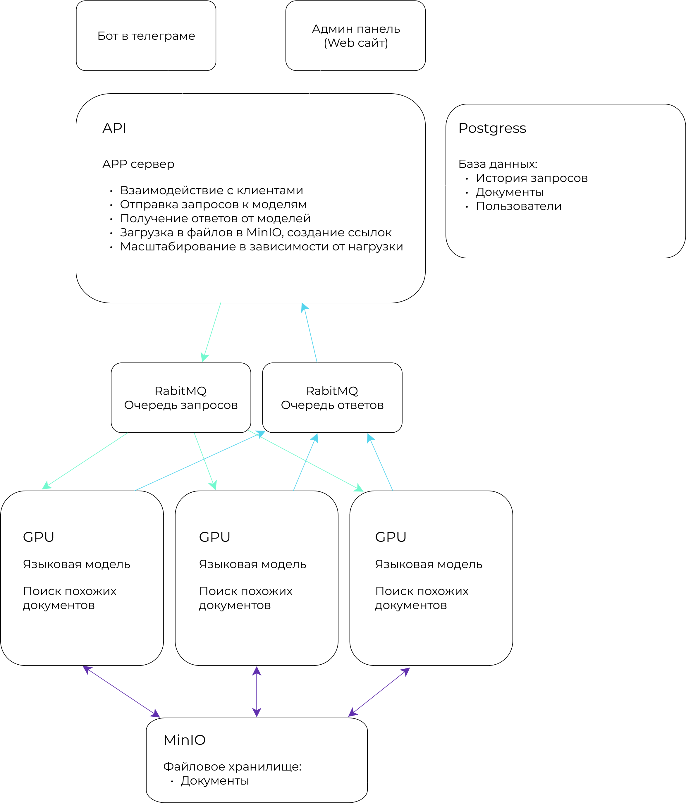

## Назначение и используемые технологии

Нейросеть подключается через rabbitmq к очереди запросов. Обрабатывает запрос, далее шлет ответ в очередь ответов.

Для сборки Docker образа требуется подключение к интернету чтобы загрузить веса модели и библиотеки. Для запуска собранного образа - интернета не требуется, если очередь находится в той же локальной сети.



### Требования
* Видеокарта с минимум 12gb памяти
* 20gb CPU

### Языковая модель
* Мы используем модель языка под названием Mistral 7B Instruct v0.2, которая в конечном итоге использует 4,5 бита на слово. Квантование проводится с использованием метода Q4_K. Этот метод представляет собой комбинацию 4-битного и 6-битного  квантования для разных весов языковой модели.

### Начало работы
#### Создание файла `.env`
Создайте файл `.env` и скопируйте из файла `.env.example` содержимое в файл `.env`.
#### Запуск проекта
Для запуска проекта выполните команду:
```bash
docker compose up --build
```
